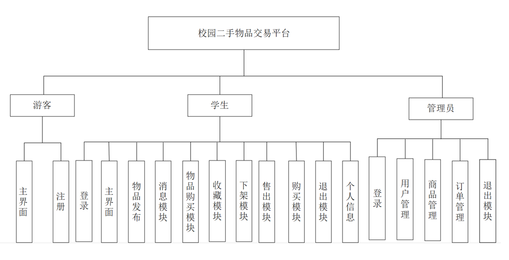
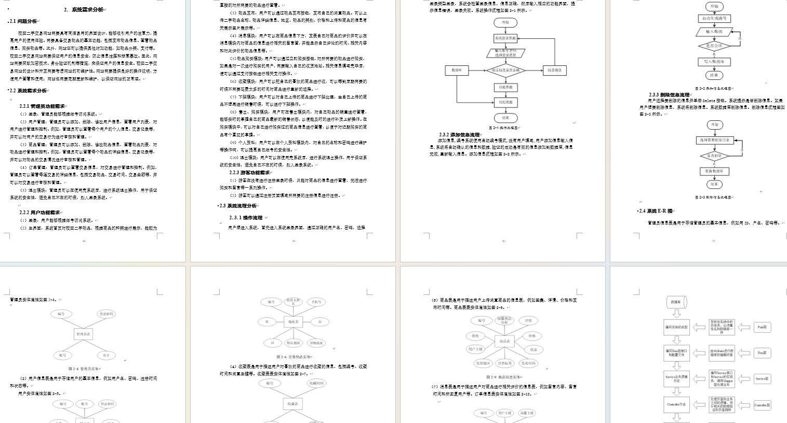
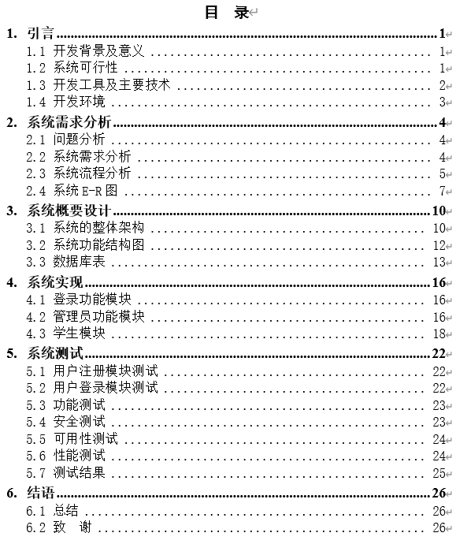
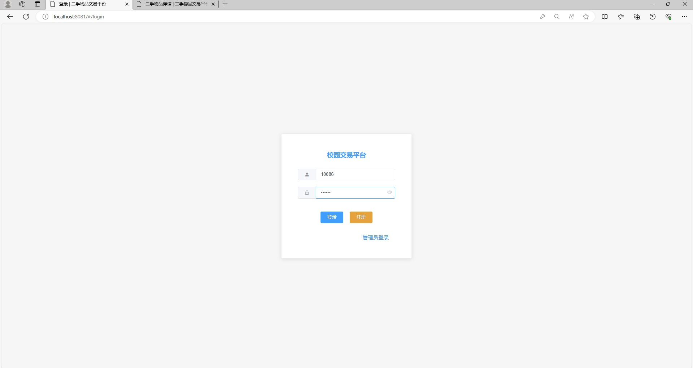
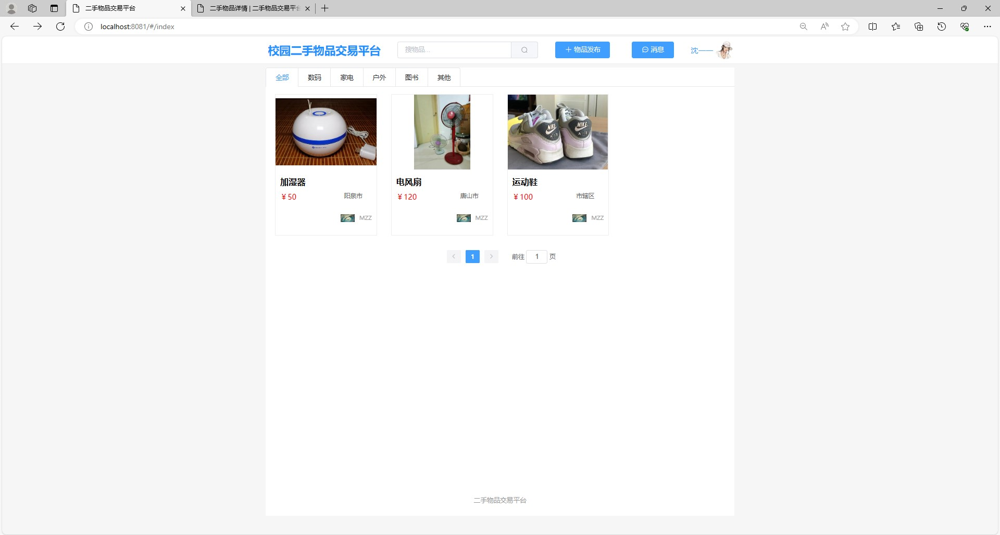
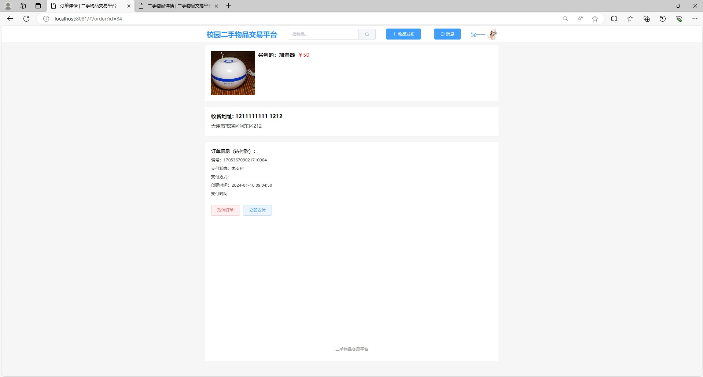
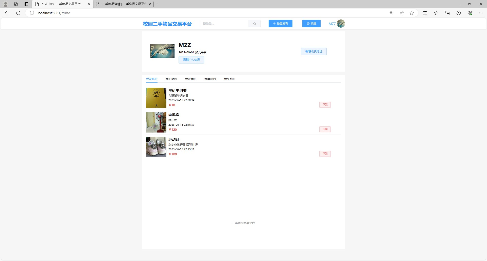
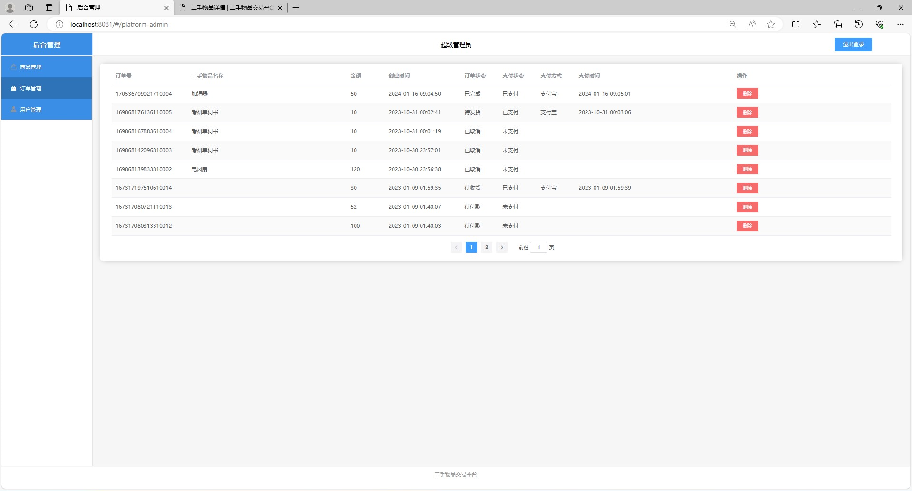

# 基于springboot和vue的校园二手交易网站

### 9.9￥ 获取完整源码+sql，附赠11000字论文参考，需要加Q：3808981644 备用Q：3577148218
### 有问题，或者需要协助调试运行项目的也可联系
### 获取更多项目，关注公众号：编程项目集

### 一、介绍

基于springboot和vue的校园二手交易网站

开发语言：java

运行环境:idea或eclipse vscode 数据库:mysql

技术：SpringBoot、Vue、MybatisPlus

有三个角色

1、游客：浏览主界面、注册  

2、学生：登录、主界面、物品发布、消息模块、物品购买模块、收藏模块、下架模块、售出模块、购买模块、退出模块、个人信息

3、管理员：登录、用户管理、商品管理、订单管理、退出模块

### 二、8000字论文参考

### 三、系统部分功能页面展示

### 9.9￥ 获取完整源码+sql，附赠万字论文参考，需要加Q：3808981644 备用Q：3577148218
### 有问题，或者需要协助调试运行项目的也可联系

